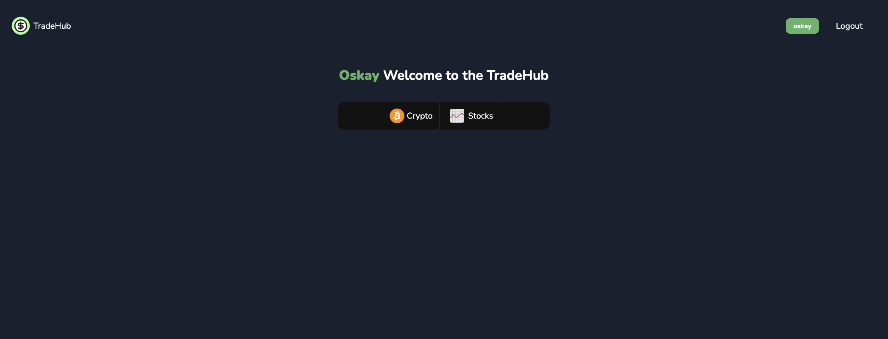

# Tradehub (Trade App) (Crypto - Stocks Trade Logger with Average Cost Calculator)


## Project Description
A trading app designed for users who want to track the average costs of their assets, such as cryptocurrencies and stocks, through a dashboard with graphical support, and keep a log of their transaction history.

## Features
- **PostgreSQL Database**: PostgreSQL is used throughout the project due to extensive operations on decimal values.
- **Asset Category Variety**: Initially, the project includes two basic asset categories: Crypto and Stocks. However, the structure of the project allows for an increase in the number of asset categories as needed.
- **Various Types and Numbers of Assets**: Users can create as many new assets as they want in the static categories provided (crypto, stocks) and keep transaction logs within these assets.
- **Asset Category Page/Dashboard**: The Asset Category Dashboard lists all assets created by the user in the selected category (e.g., under the Crypto category: Solana, IOTA, etc.).
- **Asset Detail Pages**: The asset detail pages display all transactions related to the user-created asset within a dashboard. Additionally, they show the total number of assets owned, total cost, and average cost based on the total amount held.
- **Asset Detail Dashboard**: Dashboards are created on the asset detail pages based on the user's transaction logs, showing all transactions and average costs.
- **Automatic Average Cost Calculation**: When entering a new asset transaction on an asset detail page, the average cost is calculated based on the total amount and cost for both buy and sell transactions. Users only need to enter the total asset amount and cost for the transaction they are performing.
- **Average Cost Graph**: An average cost graph is created on the asset detail page based on all purchases, showing the costs of transactions visually. This allows users to track whether their costs are increasing or decreasing.
- **Buy & Sell Transactions**: Users can log both buy and sell transactions in the system.
- **Privacy**: Only logged-in users can access their asset transaction activities and asset categories.
- **Rest API**: The project has a REST API that supports all listing, creation, deletion operations. All operations can be performed by following the documentation below. In REST API, token authentication is used as authentication method.

## API Token Creation
- Every time a new user registers, an automatic token is generated for that user with the help of signals. No extra action is required.

### How to GET API Token
`/api/api-token-auth/`

You can make a "GET" request to this URL to get the user token to use the API.

When sending an HTTP GET request, username and password must be sent in the request body.

### How to Generate New API Token
`/api/api-token-auth/generate/`

You need to make a "GET" request to this URL with your current API Token to generate new API Token. After a succesfull request your access token will be renewed completely. Make a note of the new token or access your newly created token via the API Token Page page on the site.

### On Site GET API Token and Generate New API Token

`/account/api-token/`

Visit this page (while you have logged in session) to get API Token on site. You can access this page by using navbar.

## API Endpoints Documentation

### GET URLs
- **List All Categories**:  
  `/api/categories/`  
  Lists all active categories on the site where assets can be created.

- **List All Assets in a Category**:  
  `/api/<category_slug>/assets/`  
  Lists all assets created under the specified category.  
  Example URL: `/api/crypto/assets/`

- **Asset Details and Transaction Logs**:  
  `/api/<category_slug>/assets/<asset_slug>/`  
  Lists details and transaction logs for the specified asset under the specified category.  
  Example URL: `/api/crypto/assets/yyizuhvhayrwxjp/`

### POST (Create) URLs
- **Create an Asset in a Category**:  
  `/api/<category_slug>/assets/create/`  
  Creates an asset with the name sent in a POST request in the specified category.  
  Example URL: `/api/crypto/assets/create/`

    Example Request Body: `{"name":"test"}`

- **Add a Transaction to an Asset**:  
  `/api/<category_slug>/assets/<asset_slug>/transaction/`  
  Adds a new transaction (buy or sell) to the specified asset in the specified category. The transaction is recorded directly in the database, and the asset data is updated.

  Example Request Body: `{"amount":213123.123, "cost":12350, "transaction_type":"buy"}` (Cost data optional, if its not provided it will be processed as 0)

### DELETE URLs
- **Delete a Specific Transaction**:  
  `/api/<category_slug>/assets/<asset_slug>/transaction/delete/<transaction_id>/`  
  Deletes the transaction with the specified `transaction_id` for the asset in the specified category using an HTTP Delete Request. No data needs to be sent in the request body, just an authentication token.

  Example Delete Request URI: `/api/crypto/assets/xfunnlzmlmtnckr/delete/2/` - To get transaction ID you can check asset detail response. In asset detail request's response you can see all transactions and their IDs.

- **Delete an Asset**:  
  `/api/<slug:category_slug>/assets/<slug:asset_slug>/delete/`  
  Permanently deletes the specified asset from the specified category using an HTTP Delete Request.

    Example Delete Request URI: `/api/crypto/assets/xfunnlzmlmtnckr/delete/` - Permanently deletes the asset with slug 'xfunnlzmlmtnckr'

## Limitations
- Users need to register to use the app. In order to use the REST API, the token information of the user whose asset information will be worked on is needed.

## Getting Started

To get started with this project, follow these steps:

**Step 1**: Clone the project
```bash
git clone https://github.com/oskaygunacar/django-finance-app.git
```

**Step 2**: Navigate to the directory
```bash
cd django-finance-app
```

**Step 3**: Create and activate a virtual environment
```bash
# Create
python -m venv env

# Activate for MacOS & Linux
source env/bin/activate

# Activate for Windows
env\Scripts\activate
```

**Step 4**: Install dependencies
```bash
pip install -r requirements.txt
```
**Step 5**: Configure Settings.py Database Configurations

**If you are planning to use PostgreSQL or other databases, please configure the Settings.py database config first.**

**Step 6**: Migrate the database and create a superuser
```bash
python manage.py migrate
python manage.py createsuperuser
```

**Step 7**: Run the server
```bash
python manage.py runserver
```

## Usage

- Navigate to the site URL to create an account and login to site.
- After login process, you are free to create/log any amount of asset and asset transaction.

## Contributing

Contributions to improve the project are welcome. Please follow the standard fork-and-pull request workflow.


## App Images:
### Homepage

### Homepage Authenticated

### Login Page of the App

### Signup Page of the App

### Profile Actions on Site Navbar

### Asset Category Dashboard

### Add New Asset Transaction Page

### Asset Detail / Dashboard

### API Token Landing Page
